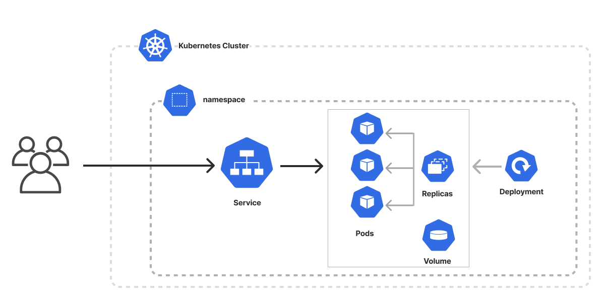

# Ben-s_Project


## Overview

The project includes two applications, frontend and backend.
This repo provide description how to implement the app on Kubernetes environment.

## Setup

1) Install minikube:
  https://minikube.sigs.k8s.io/docs/start/  
  Minikube provides a standalone Kubernetes environment (with kubectl)  
  
  **What you’ll need**
    
   * 2 CPUs or more
   * 2GB of free memory
   * 20GB of free disk space
   * Internet connection
   * Container or virtual machine manager, such as: Docker

2) After the installation check `kubectl version`

## System architecture

The main concept in this environment is to deploy the application in Kubernetes environment based on the model in the image below:



(communication with `ingress` deployment should be added  )  

## Deployment

  1) Create Dockerfile and build the image for each application: frontend, backend.
  2) Import the images into Minikube: ` minikube image load <docker_image:version>`
  3) cd into `k8s-files` and run `deploy_app.sh` script

## Services communication

### Services  
Services use the Kubernetes DNS service to resolve the IP addresses of pods. 
Kubernetes DNS: Kubernetes provides a built-in DNS service that allows pods to communicate with each other using domain names.  
Pods can look up the IP address of a service using its domain name, eliminating the need to hardcode IP addresses.1

When a Pod runs on a Node, the kubelet (k8s api internal control service) adds a set of environment variables for each active Service.  

```bash

kubectl exec my-nginx-3800858182-e9ihh -- printenv | grep SERVICE

KUBERNETES_SERVICE_PORT=443
MY_NGINX_SERVICE_HOST=10.0.162.149
KUBERNETES_SERVICE_HOST=10.0.0.1
MY_NGINX_SERVICE_PORT=80
KUBERNETES_SERVICE_PORT_HTTPS=443

```
You can access a service via it's DNS name: 
servicename.namespace.svc.cluster.local


### Connecting from pod  
it is possible to try and `curl` or connect with a service from one pod (e.g. frontend) to the other. 
Do the following:

1) connect to the frontend pod and run curl as follow:
   ```bash 

  kubectl exec -it <pod's_name> -- sh

  token=$(cat /var/run/secrets/kubernetes.io/serviceaccount/token)
  ca_crt="/var/run/secrets/kubernetes.io/serviceaccount/ca.crt"
   
  curl -v --cacert $ca_crt \
  -H "Authorization: Bearer $token" \ 
  https://$KUBERNETES_SERVICE_HOST:$KUBERNETES_SERVICE_PORT_HTTPS/api/v1/namespaces/ben-app/pods/$HOSTNAME

  ```

 The response should be a json structure with information on the existing pod.

### Creating another pod from the backend
Due to the `role` `service-account` and role binding we assigned to the backend, it can create and initiate another pod.

THe script `create_pod.sh` do that.
The profile of the pod is based on `echo-pod.json` data file the provided as input.

```bash

#!/bin/sh

token=$(cat /var/run/secrets/kubernetes.io/serviceaccount/token)

ca_crt="/var/run/secrets/kubernetes.io/serviceaccount/ca.crt"

#curl -v --cacert $ca_crt -H "Authorization: Bearer $token" https://$KUBERNETES_SERVICE_HOST:$KUBERNETES_SERVICE_PORT_HTTPS/api/v1/namespaces/ben-app/pods/$HOSTNAME

curl -k -v -X POST -H "Authorization: Bearer $token" \
-H "Content-Type: application/json" \
-d@echo-pod.json \
https://$KUBERNETES_SERVICE_HOST:$KUBERNETES_SERVICE_PORT_HTTPS/api/v1/namespaces/ben-app/pods


```

json file for creating the pod:

```json

{
    "apiVersion": "v1",
    "kind": "Pod",
    "metadata": {
        "labels": {
            "app": "app-alpine",
            "env": "dev"
        },
        "name": "app-alpine",
        "namespace": "ben-app"
    },
    "spec": {
        "containers": [
            {
                "command": [
                    "/bin/sh",
                    "-c" 
		],
                "args": [
                    "echo \"This is my message to the world\"; sleep 15;"
                ],
                "image": "alpine",
                "name": "app-alpine"
            }
        ],
        "restartPolicy": "Never"
    }
}

```